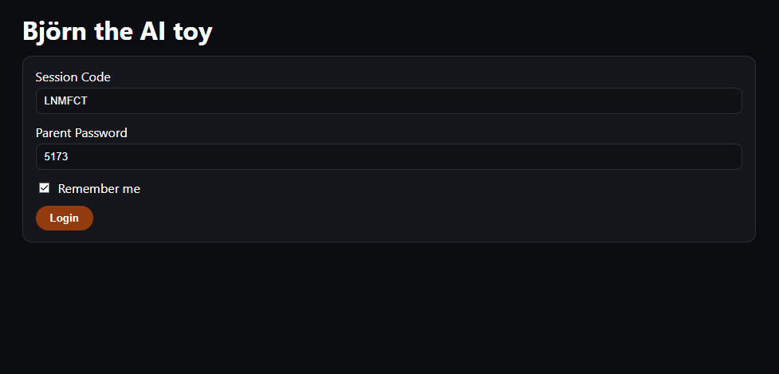

# Björn Web – Parent Session Viewer for Björn the AI Toy

Björn Web is the companion web interface for **Björn the AI Toy** - a physical, locally-running, speech-enabled toy that interacts with children through conversation.  
This frontend allows parents to **securely view ongoing or past chat sessions** and monitor conversations in real time.

The system integrates with the backend service (see below) that streams recorded messages and metadata from the toy.

---

Backend repository: **https://github.com/PaulBueckhard/bjoern**

---

## Features

### Secure Parent Login  
Parents authenticate with:
- a **6-character session code** (spoken by the toy), and  
- a **4-digit parent password**.

Supports *“Remember Me”* login persistence using `localStorage`.


### Live Session Viewer  
The session viewer:
- polls the backend every 2 seconds  
- displays messages from child (“user”) and Björn (“assistant”)  
- automatically scrolls when new messages arrive (unless manually scrolled up)  
- shows message timestamps and roles  
- handles backend errors gracefully with UI feedback  


### Clean UX  
- Toast notifications  
- Smooth fade-in chat bubbles  
- Compact mobile design  
- Clear, accessible navigation  


### Zero-Bundle Configuration  
The app is built with:
- **React + TypeScript**
- **Vite** for fast dev environment
- **React Router v6**
- Minimal, dependency-free state management

---
## Architecture
```text
                   ┌──────────────────────────┐
                   │      Björn the Toy       │
                   │  • Local microphone input│
                   │  • Local LLM inference   │
                   │  • Speaks replies        │
                   │  • Stores conversation   │
                   └──────────────┬───────────┘
                                  │
                                  │ (session logs + metadata)
                                  ▼
                 ┌──────────────────────────────────┐
                 │            Backend API           │
                 │  • Python server (FastAPI)       │
                 │  • Serves /api/session/:id       │
                 │  • Validates parent PIN          │
                 │  • Provides chat history         │
                 │  • Runs locally on home network  │
                 └──────────────────┬───────────────┘
                                    │
                                    │ HTTP GET (polling every 2s)
                                    ▼
            ┌────────────────────────────────────────────────┐
            │                  Björn Web UI                  │
            │   (React + TypeScript + Vite)                  │
            │                                                │
            │ • Parent login (session code + PIN)            │
            │ • Optional "Remember Me" storage               │
            │ • Live message viewer                          │
            │ • Auto-scroll, error handling, toast UI        │
            │ • Polls backend for new messages               │
            └────────────────────────────────────────────────┘


```

---

## Backend Integration

This frontend communicates with the backend API implemented here:

-> **https://github.com/PaulBueckhard/bjoern**

The backend exposes a REST endpoint:

```
GET /api/session/:shortId?pin=XXXX
```

which returns:

```ts
interface {
  child_name: string
  messages: {
    role: "user" | "assistant"
    content: string
    ts: number
  }[]
}
```

The frontend performs:
- sanitization of user input  
- error handling for invalid passwords / sessions  
- secure validation to ensure parents may only view authorized sessions  

---

## Environment Setup

Create a `.env` file:

```
VITE_API_BASE=http://192.168.2.31:5000
VITE_API_TOKEN=
```

---

## Running the Project

### Install dependencies

```sh
npm install
```

### Start development server

```sh
npm run dev
```

Visit: **http://localhost:5173**
- Note: The viewer only works if the backend (`server.py`) is running.


---

## Authentication & Security

- Session codes and parent passwords are **never stored on the server via this frontend** - only fetched.
- Parent login may optionally be remembered via encrypted localStorage values.
- Session validation uses multiple checks to prevent viewing incorrect sessions:
  - session code mismatch
  - missing saved login
  - missing parent password

---

## Key UI Behaviors

### Auto-scroll logic
- If the user is at the bottom, new messages will scroll into view.
- If the user scrolls up to inspect older messages, auto-scroll pauses.

### Error Handling
Errors (e.g., invalid session code, lost backend connection, missing credentials) are shown via:
- toast messages  
- inline UI placeholders  
- graceful fallback states (“No messages yet”, “Loading…”)  

---

## Why This Project Exists

Björn the AI toy runs a **local LLM**, processing a child’s spoken input and generating replies.  
Because children interact with the toy independently, parents need a **simple, secure tool** to review sessions.

This frontend provides exactly that:
- a safe, private parent-facing interface  
- a clean, responsive UI  
- compatibility with any backend instance of Björn  

---
## Screenshots
### Login Page


### Message Viewer

